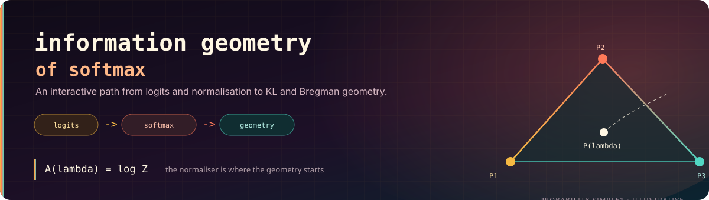

  
  
  

# Information Geometry of Softmax

An interactive educational companion to the paper *The Information Geometry of
Softmax*. The project makes the transition from logits to probability geometry
explorable without hiding the mathematics.

The central idea is simple but consequential: Softmax does not only normalise scores.
Through exponentiation and normalisation, it changes how distances and movements in a
representation space should be interpreted.

---

## Open the visualisers

| Part | Browser preview | Source notes |
|---|---|---|
| Part 1 - Softmax Foundation | [Open in browser](https://htmlpreview.github.io/?https://github.com/divyamtewary/research/blob/main/Information%20Geometry%20of%20Softmax/ResearchVisualiser/Part1_SoftmaxFoundation.html) | [`ResearchScope_01.md`](ResearchScope_01.md) |
| Part 2 - Geometry and KL | [Open in browser](https://htmlpreview.github.io/?https://github.com/divyamtewary/research/blob/main/Information%20Geometry%20of%20Softmax/ResearchVisualiser/Part2_GeometryAndKL.html) | [`ResearchScope_02.md`](ResearchScope_02.md) |

The visualiser source and its complete scope are in
[`ResearchVisualiser/`](ResearchVisualiser/), including
[`ResearchVisualiserScope.md`](ResearchVisualiser/ResearchVisualiserScope.md).

---

## Aim

The original paper is mathematically dense and assumes familiarity with exponential
families, information geometry, and Bregman divergences. This project is an interactive
companion for readers who know basic linear algebra and neural networks but want to build
the intuition progressively.

The visualiser follows a fixed teaching sequence:

`Big Question -> Intuition -> Math -> Visualisation -> Key Insight -> Next Section`

The equations remain present. The interactive components are there to make their effect
visible, not to replace the derivation.

---

## Part 1 - Softmax Foundation

| Section | Concept | Interactive element |
|---|---|---|
| 1 | Euclidean representation space versus probability space | Side-by-side comparison |
| 2 | The Softmax transformation | Live logits-to-probabilities chart |
| 3 | Partition function `Z` and log-normaliser `A(lambda)` | Sensitivity explorer |
| 4 | `grad A = P` | Visual gradient proof |
| 5 | `dP_i/dlambda_i = P_i(1-P_i)` | Self-derivative explorer |

Part 1 establishes the partition function, the log-normaliser, and the gradient identity
that connects the normaliser to the probability distribution.

---

## Part 2 - Probability Geometry

| Section | Concept | Interactive element |
|---|---|---|
| 1 | Cross-derivative `dP_j/dlambda_i = -P_iP_j` | Coupled token sliders |
| 2 | Global coupling and probability stealing | Probability-flow diagram |
| 3 | Behavioural distance via KL divergence | Distribution comparison and heatmap |
| 4 | Expectation and the gradient identity | Weighted centre-of-mass view |
| 5 | KL as a Bregman divergence | Tangent-plane geometry |

The main result is that changing one logit changes every probability through the shared
normaliser. This coupling leads naturally from Softmax behaviour to KL divergence and
then to Bregman geometry.

---

## How to use it

1. Clone or download this directory.
2. Open either HTML file in a browser.
3. Use the sliders and controls to change logits and distributions.
4. Follow the sections in order if the material is new.

The HTML visualisers are self-contained and require no build step, server, Python
environment, or external dependency. A local MathJax copy is included for offline use.

---

## Caveats

- A two-dimensional drawing cannot show the full geometry of a high-dimensional space.
- KL divergence is directional and is not an ordinary Euclidean distance.
- The visualisations are educational explanations of the identities, not empirical claims
  about how a particular trained transformer stores concepts.
- The project covers the first half of the paper and does not claim to be a complete
  treatment of information geometry.

---

## Related work

- [`neural-observatory`](https://github.com/divyamtewary/side-projects/tree/main/neural-observatory) - inspect activations and logit-lens behaviour in a small language model.
- [`llm-local-harness`](https://github.com/divyamtewary/development/tree/main/llm-local-harness) - run small language models locally on constrained hardware.
- [`research`](https://github.com/divyamtewary/research) - the wider research notebook.

---

## Project status

This is an educational research artifact and is still being extended. A project license
will be added when the artifact is finalized for wider reuse.
