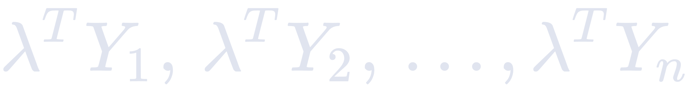
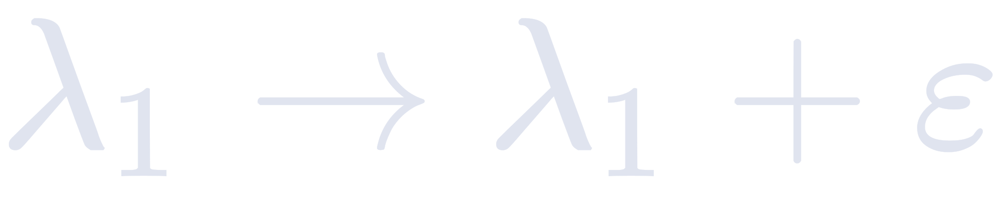
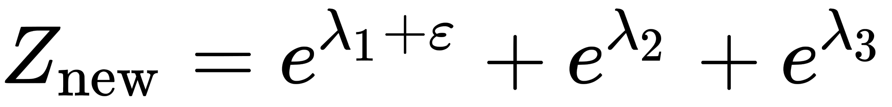
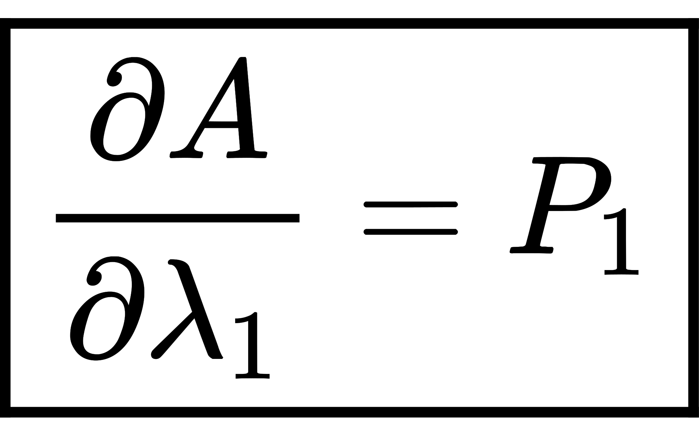

# The Information Geometry of Softmax

> Personal study notes based on *The Information Geometry of Softmax* paper.
> *(Math rendered with KaTeX SVGs via GitHub Actions)*

---

# Goal of the Paper

The central objective of this paper is to understand how the **linear representation hypothesis** interacts with the natural **information geometry** of the representation space.

More specifically, the paper studies the special case of **Softmax-based models**, showing how the Softmax transformation changes the geometry of the representation space and discussing the implications of this geometry for interpretability methods.

---

# Flat Euclidean Representation Space

Traditionally, researchers think of a neural network's hidden representation as a point inside a high-dimensional Euclidean space.

Under the **Linear Representation Hypothesis**, semantic concepts occupy approximately linear directions inside this hidden space.

Example:

```
dog ---------------------- cat
```

Moving in a straight direction inside the hidden representation should gradually transform one concept into another.

This assumption treats the hidden representation space as **flat (Euclidean).**

---

# Why Softmax Changes Everything

Neural networks do not directly output hidden vectors.

Instead, they output **probability distributions**.

The mapping from hidden vectors to probabilities is performed by the **Softmax function.**

Softmax converts raw scores (**logits**) into probabilities.

These probabilities

- are always positive
- lie between 0 and 1
- sum to exactly 1

---

# The Softmax Distortion

Softmax performs two important operations.

1. Exponentiation

Each logit is exponentiated.


2. Normalization

The exponentials are divided by their total sum.

Because exponentiation is nonlinear, the geometry becomes warped.

## Key Insight

A straight line inside the raw logit space is generally **not** a straight line inside probability space.

Softmax effectively bends the geometry.

---

# Hidden Representation

Assume the model produces a hidden representation


where

- "math_svgs/ic6a6eb61fd9c.svg" alt="math" style="display:inline;vertical-align:middle;max-width:100%"/>"math_svgs/ic6a6eb61fd9c.svg" alt="math" style="display:inline;vertical-align:middle;max-width:100%"/> is a hidden vector
-  is the dimensionality of the hidden space

Example

If


then every hidden representation is simply a vector containing 2048 real numbers.

The focus of this paper is understanding how this hidden vector is converted into probabilities.

---

# Output Representations

For every candidate output token


each output embedding satisfies


meaning every output embedding has exactly the same dimensionality as the hidden representation.

---

# Softmax Probability Distribution

The probability of selecting token src="math_svgs/i8a08bb342996.svg" alt="math" style="display:inline;vertical-align:middle;max-width:100%"/> given hidden representation "math_svgs/ic6a6eb61fd9c.svg" alt="math" style="display:inline;vertical-align:middle;max-width:100%"/> is


---

# Understanding Every Component

## 1. Probability


This represents the probability that the model predicts token  given hidden representation $\lambda$.

---

## 2. Exponential


Exponentiation ensures every score becomes positive.

Negative logits become small positive numbers.

Large logits become much larger.

---

## 3. Dot Product


This is the similarity score between

- hidden representation
- output embedding

It is an ordinary dot product.

Properties

- scalar value
- can be negative
- can be positive
- unbounded

The collection



forms the **logit vector**.

---

# The Log-Normaliser

The term


is called the **log-normaliser**.

Its role is to ensure that all probabilities sum to one.

Since probabilities must satisfy


the raw logits cannot be used directly.

Instead,

f85dcbd0.svg" alt="math" style="display:block;margin:1em auto;max-width:100%"/>f85dcbd0.svg" alt="math" style="display:block;margin:1em auto;max-width:100%"/>

where


---

# Understanding the Partition Function

Consider three logits

| Token | Logit |
|-------|------:|
| A | 2 |
| B | 1 |
| C | 0 |

These are **not probabilities.**

---

## Step 1

Exponentiate each logit.


---

## Step 2

Compute the partition function.


or generally


---

## Step 3

Normalize


Now

- every probability is positive
- probabilities sum to one

Also,

54f85dcbd0.svg" alt="math" style="display:block;margin:1em auto;max-width:100%"/>

---

# Sensitivity of the Partition Function

Question:

> What happens if one logit changes slightly?

Suppose


Increase only



Then



Using


and


we obtain


Therefore


---

# Derivative of the Partition Function

Taking the derivative,


This measures how rapidly the partition function grows as  changes.

---

# Derivative of the Log-Normaliser

Since

$$
A(\lambda)=\log Z
$$

Chain rule gives


Substituting


gives


Recognize that

.svg" alt="math" style="display:block;margin:1em auto;max-width:100%"/>

Therefore



---

# Key Result

The gradient of the log-normaliser equals the Softmax probability.


This is one of the central geometric results of the paper.

---

# Deriving the Rate of Change of Softmax Probability

Recall


Using the quotient rule,


Rearranging,


This describes how a token's probability changes as its own logit changes.

---

**End of Part 1**