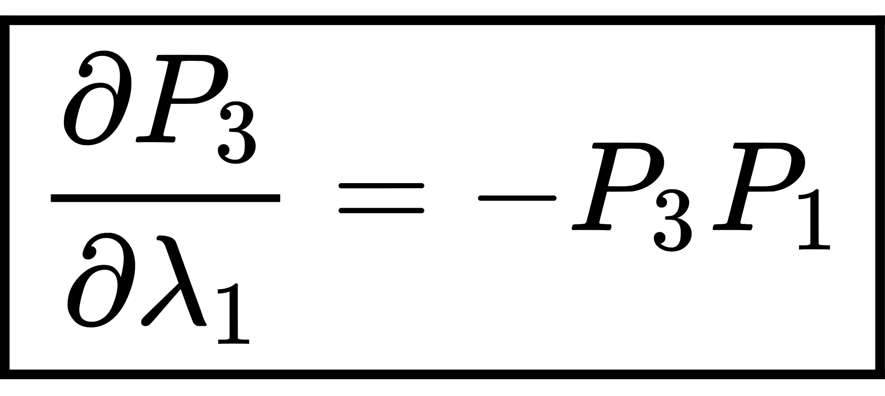
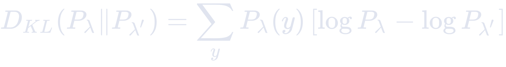
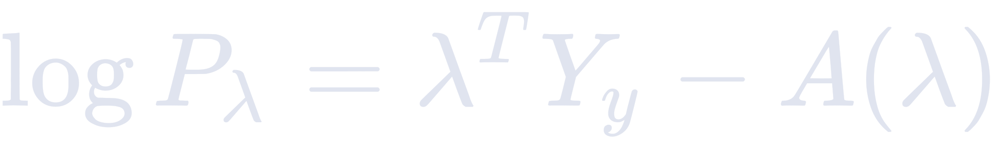
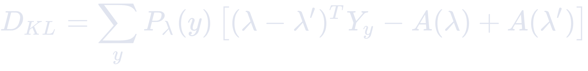
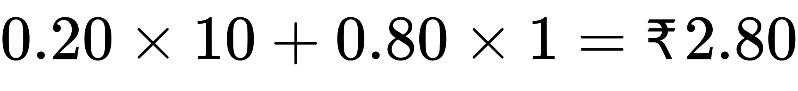
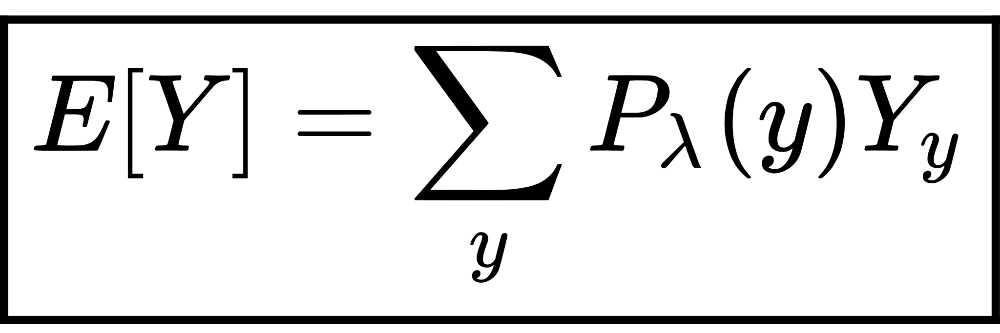
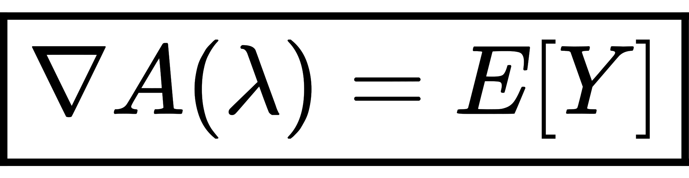
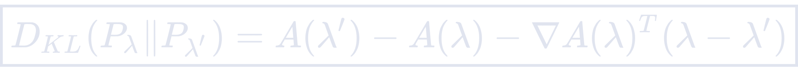
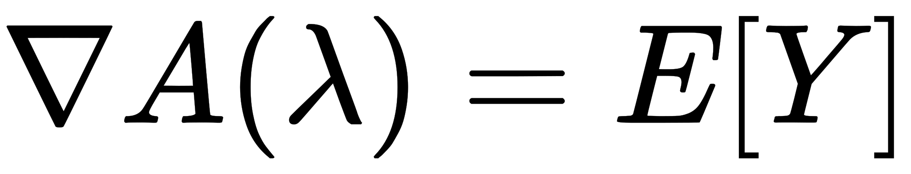
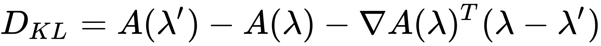

# The Information Geometry of Softmax
## Part 2 — Probability Geometry, KL Divergence and Bregman Geometry
> *(Math rendered with KaTeX SVGs via GitHub Actions)*

---

# Overview

This section continues the derivation started in Part 1.

Previously we established

1. The partition function

2. The log-normaliser

f85dcbd0.svg" alt="math" style="display:block;margin:1em auto;max-width:100%"/>

3. The gradient of the log-normaliser

4. The self-derivative of Softmax

lay:block;margin:1em auto;max-width:100%"/>lay:block;margin:1em auto;max-width:100%"/>

This section answers two new questions:

- How do the probabilities of *other* tokens change when one logit changes?
- How does this lead naturally to the geometry induced by Softmax?

---

# Cross-Derivative of Softmax

Suppose

We now increase

instead.

Notice something important.

The numerator

does **not** change.

Only the denominator changes because

still contains

---

## Applying the Quotient Rule

Since

and

we obtain

Recognizing

.svg" alt="math" style="display:block;margin:1em auto;max-width:100%"/>

gives

Likewise,

---

# Interpretation

Two complementary results have now emerged.

Self influence:

$$
\frac{\partial P_i}{\partial\lambda_i}
=
P_i(1-P_i)
$$

Cross influence:

These equations reveal a competition between tokens.

Increasing one logit necessarily steals probability mass from every other token.

Softmax is therefore **globally coupled**.

No token exists independently.

---

# Conceptual Interpretation

When the logit of token 1 increases

- token 1 gains probability
- every other token loses probability

The amount each token loses depends upon

its current probability.

Tokens that already have very small probability lose almost nothing.

Large-probability competitors lose the most.

---

# Measuring Behavioral Distance

The paper now changes perspective.

Instead of asking

> "How different are two hidden vectors?"

it asks

> "How different are the probability distributions they produce?"

Suppose

Current hidden state

moves to

The correct notion of distance is therefore

the difference between

and

---

# KL Divergence

The behavioral distance is measured using

the Kullback-Leibler divergence.

Definition

KL divergence measures how surprising one probability distribution appears when compared with another.

It is **not**

- Euclidean distance

nor

- cosine similarity.

It measures behavioral change.

---

# Substituting the Softmax Formula

Recall

Substituting this into KL divergence gives

# Expected Value

Before simplifying this equation,

the paper introduces expectation.

Expectation is simply a weighted average.

Example

Suppose a game pays

- ₹10 with probability 0.20
- ₹1 with probability 0.80

Expected payout

Neural networks follow exactly the same idea.

Instead of money,

our outcomes are

the output embeddings.

Therefore

This is the probability-weighted average output embedding.

Geometrically,

it represents the center of mass of the output embeddings.

---

# Gradient Interpretation

Earlier we proved

Collecting all partial derivatives produces

the gradient

d4904821.svg" alt="math" style="display:block;margin:1em auto;max-width:100%"/>

Since every component equals a probability,

the complete gradient becomes

Recognize immediately that

This is one of the most important identities in the paper.

The gradient is literally the expected output representation.

---

# Simplifying the KL Divergence

Starting from

$$
D_{KL}
=
\sum_y
P_\lambda(y)
\left[
(\lambda-\lambda')^TY_y
-
A(\lambda)
+
A(\lambda')
\right]
$$

Notice

and

are constants with respect to the summation.

Since

they simplify immediately.

The first vector term can also be factored outside the summation.

This produces

Replacing the summation with

$$
\nabla A(\lambda)
$$

gives

---

# Final Result

Putting everything together,

the KL divergence becomes

This is exactly the definition of a **Bregman divergence**.

---

# Geometric Meaning

This result completely changes how we think about hidden representations.

We started with

a statistical definition

(KL divergence).

Pure algebra transformed it into

a geometric definition

(Bregman divergence).

Therefore

Softmax does not merely convert logits into probabilities.

It induces an entirely new geometry on the representation space.

The curvature of that geometry is governed by

The hidden representation space is therefore **not Euclidean**.

Instead,

it is an information-geometric manifold whose distance is naturally measured using KL divergence.

---

# Core Mathematical Results

The first half of the paper establishes several foundational identities.

### Softmax

$$
P_i=\frac{e^{\lambda_i}}Z
$$

### Partition Function

### Log-Normaliser

$$
A(\lambda)=\log Z
$$

### Gradient

### Self-Derivative

$$
\frac{\partial P_i}{\partial\lambda_i}
=
P_i(1-P_i)
$$

### Cross-Derivative

### Expected Value

### Gradient Identity

### KL Divergence

---

# Key Takeaways

- Softmax globally couples every token.
- Increasing one probability necessarily decreases all others.
- The gradient of the log-normaliser equals the expected output embedding.
- KL divergence naturally becomes a Bregman divergence.
- Softmax transforms a flat Euclidean space into a curved information-geometric manifold.