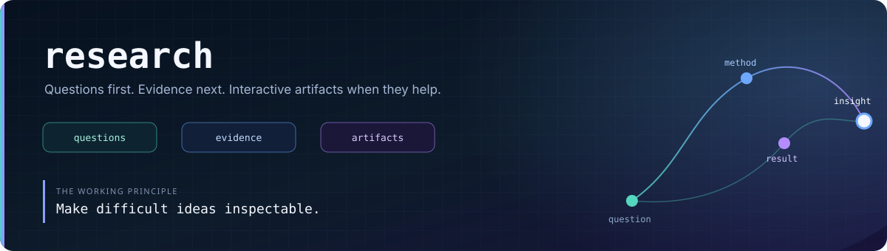

  
  
  

# research

A public research notebook for understanding machine learning ideas by deriving them,
testing them, and making them explorable.

This repository is deliberately slower than a demo repository. The useful output is not
only the visualisation or the final equation; it is the chain from question to explanation
to an artifact that another person can inspect.

---

## What lives here

- Research notes that unpack difficult papers and concepts.
- Browser-based visualisers for mathematical ideas.
- Small experiments that connect theory to model behaviour.
- Supporting SVG equations and reproducible source material.

The repository is part of a wider set of public work:

| Repository | Role |
|---|---|
| [`side-projects`](https://github.com/divyamtewary/side-projects) | Local AI experiments and interactive tools |
| [`development`](https://github.com/divyamtewary/development) | Systems, runtimes, and agent engineering |
| [`blog`](https://github.com/divyamtewary/blog) | Written reflections and project context |

---

## Current Artifact: Information Geometry of Softmax

[`Information Geometry of Softmax/`](Information%20Geometry%20of%20Softmax/)
is an interactive educational companion to the paper *The Information Geometry of
Softmax*. It studies how Softmax maps a Euclidean logit representation into probability
space and how that mapping induces a different geometry.

The project is designed to teach intuition before notation while keeping the derivations
visible. Its central ideas are:

- The partition function and log-normaliser.
- The gradient identity `grad A = P`.
- Self- and cross-derivatives of Softmax.
- Global probability coupling between tokens.
- KL divergence as a behavioural distance.
- The connection between KL divergence and Bregman geometry.

### Research Visualiser Scope

The visualiser is split into two browser-ready parts:

| Part | Focus | Interactive sections |
|---|---|---|
| [Part 1](Information%20Geometry%20of%20Softmax/ResearchVisualiser/Part1_SoftmaxFoundation.html) | Softmax foundation | Representation space, Softmax, partition function, log-normaliser gradient, self-derivative |
| [Part 2](Information%20Geometry%20of%20Softmax/ResearchVisualiser/Part2_GeometryAndKL.html) | Probability and information geometry | Cross-derivative, probability stealing, KL divergence, expectation, Bregman geometry |

Each section follows the same learning sequence:

`Big Question -> Intuition -> Math -> Visualisation -> Key Insight -> Next Section`

The full project scope is documented in
[`ResearchVisualiserScope.md`](Information%20Geometry%20of%20Softmax/ResearchVisualiser/ResearchVisualiserScope.md).

---

## How to navigate

1. Start with the [research notes](Information%20Geometry%20of%20Softmax/ResearchScope_01.md).
2. Continue with [Part 2 notes](Information%20Geometry%20of%20Softmax/ResearchScope_02.md).
3. Open either [Part 1](Information%20Geometry%20of%20Softmax/ResearchVisualiser/Part1_SoftmaxFoundation.html) or [Part 2](Information%20Geometry%20of%20Softmax/ResearchVisualiser/Part2_GeometryAndKL.html) directly in a browser.
4. Read the [visualiser scope](Information%20Geometry%20of%20Softmax/ResearchVisualiser/ResearchVisualiserScope.md) for the intended learning path.

The visualisers are self-contained HTML files. They do not require a build step or a
Python environment.

---

## Working principles

- Start with a precise question instead of a fashionable topic.
- Use an interactive artifact when it reveals something a static paragraph cannot.
- Keep derivations and caveats visible.
- Distinguish intuition, measurement, and interpretation.
- Treat visualisations as instruments, not proof by appearance.

---

## Roadmap

- [ ] Extend the Softmax visualiser beyond the current first-half treatment.
- [ ] Connect information-geometric concepts to measured transformer behaviour.
- [ ] Add small, reproducible experiments alongside future research notes.
- [ ] Cross-link completed research with the related projects and blog posts.

---

## Author

Divyam Tewary is exploring practical AI systems, small language models, and the
mechanisms that make intelligent behaviour visible.
